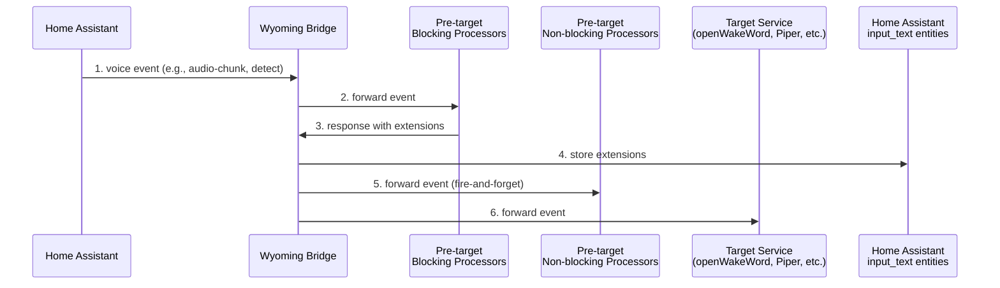
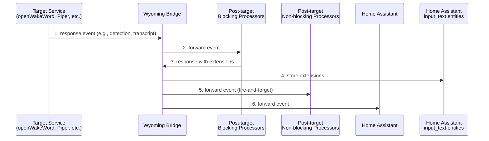

# Wyoming Bridge

**Wyoming Bridge** lets you plug custom services into Home Assistant's voice pipeline to intercept, analyze, and enrich voice events. For example, you could add speaker identification, language detection, or emotion analysis without modifying Home Assistant's core pipeline.

It works as a proxy between Home Assistant and your existing Wyoming services (like openWakeWord or Piper). You can route events to your custom processors either before or after they reach the target service, giving you complete control over when and how your processing logic runs.

<p align="center">⚠️🚧 EXPERIMENTAL & WORK IN PROGRESS 🚧⚠️</p>

## Table of Contents

- [Goals](#goals)
- [How it works](#how-it-works)
  - [Main Concepts](#main-concepts)
  - [Pipeline Flow](#pipeline-flow)
- [Usage](#usage)
  - [Docker Compose Setup](#docker-compose-setup)
  - [Processor Configuration](#processor-configuration)
  - [Home Assistant Access Token](#home-assistant-access-token)
  - [Home Assistant Input Text Configuration](#home-assistant-input-text-configuration)
  - [Running the Setup](#running-the-setup)
- [Demos](#demos)
- [TODO](#todo)
- [Contributing](#contributing)

## Goals

- Enable rapid experimentation with voice processing features without modifying Home Assistant's core pipeline.
- Provide a flexible integration point where developers can inject custom processing logic
- Allow testing of community-requested features like speaker identification, emotion detection, and language identification
- Bridge the gap between experimental ideas and stable implementation by providing a safe sandbox environment
- Identify Wyoming protocol limitations in real-world scenarios (like context passing between pipeline stages) to inform future protocol improvements

### _Non_-goals

- This is a development and experimentation tool, not a replacement for core Wyoming components
- Features and APIs may change as we learn what works best
- Perfect for testing ideas, but consider the experimental nature for critical deployments

## How it works

Wyoming Bridge acts as an intelligent proxy that sits between Home Assistant and your existing Wyoming services. It intercepts voice events flowing through the pipeline and allows you to inject custom processing logic at specific points.

### Main Concepts

- **Server**: The Wyoming component that initiates events (typically Home Assistant or a Wyoming Satellite)
- **Target**: The primary Wyoming service you want to wrap (like openWakeWord, Piper, or Faster Whisper)
- **Processor**: Your custom Wyoming service that adds functionality like speaker identification or emotion detection
- **Subscription**: Configuration that defines when and how a processor interacts with specific events
- **Stage**: When processing happens - either `pre_target` or `post_target`
- **Mode**: How processing happens - either `blocking` (waits for response) or `non_blocking` (fire-and-forget)
- **Extensions**: Key-value data that blocking processors can return to store context or analysis results in Home Assistant's `input_text` entities

### Pipeline Flow

Wyoming Bridge creates two main event flows:

**Downstream Flow (Server → Target):**



1. **Home Assistant sends voice event**: Events like `audio-chunk`, `detect`, or `transcribe` are sent from Home Assistant to the bridge
2. **Bridge forwards to blocking processors**: Pre-target blocking processors receive the event and begin processing
3. **Blocking processors respond**: Processors return their response, potentially including extensions with analysis data
4. **Extensions stored in Home Assistant**: Any extensions are immediately stored in Home Assistant's `input_text` entities
5. **Bridge notifies non-blocking processors**: Pre-target non-blocking processors receive the event for observation/logging (fire-and-forget)
6. **Event forwarded to target**: The original event continues to the target service (openWakeWord, Piper, etc.)

**Upstream Flow (Target → Server):**



1. **Target service sends response**: Target services emit events like `detection` (wake word), `transcript` (speech-to-text), or `audio-chunk` (text-to-speech)
2. **Bridge forwards to blocking processors**: Post-target blocking processors receive the event for analysis or enrichment
3. **Blocking processors respond**: Processors return their response, potentially including extensions with analysis results (e.g., speaker identification, emotion detection)
4. **Extensions stored in Home Assistant**: Any extensions are immediately stored in Home Assistant's `input_text` entities for later use
5. **Bridge notifies non-blocking processors**: Post-target non-blocking processors receive the event for observation/logging (fire-and-forget)
6. **Event forwarded to Home Assistant**: The processed event continues back to Home Assistant to complete the voice pipeline

## Usage

This section shows how to set up Wyoming Bridge with Docker Compose alongside a Home Assistant container installation. This is a minimal example to get you started - you'll need to adapt it to your specific setup and custom processors.

### Docker Compose Setup

Create a `compose.yml` file:

```yml
services:
  homeassistant:
    image: "ghcr.io/home-assistant/home-assistant:stable"
    ports:
      - "8123:8123"
    volumes:
      - ./homeassistant/config:/config
    restart: unless-stopped
    network_mode: host

  whisper:
    image: homeassistant/amd64-addon-whisper:latest
    entrypoint: python3
    command: >
      -m wyoming_faster_whisper
      --uri tcp://0.0.0.0:10300
      --model tiny-int8
    ports:
      - 10300:10300
    restart: unless-stopped
    networks:
      - services-network

  # Your custom processor service
  speaker_id_service:
    build: ./my_speaker_id_processor # Path to your custom service
    ports:
      - 10301:10301
    networks:
      - services-network

  wyoming_bridge:
    build: https://github.com/loque/wyoming-bridge.git
    depends_on:
      - speaker_id_service
      - whisper
    ports:
      - "11000:11000"
    extra_hosts:
      - "host.docker.internal:host-gateway"
    entrypoint: python3
    command: >
      -m wyoming_bridge
      --uri tcp://0.0.0.0:11000
      --target-uri tcp://whisper:10300
      --hass-access-token ${BRIDGE_ACCESS_TOKEN}
      --hass-url http://host.docker.internal:8123
    volumes:
      - ./processors.yml:/app/processors.yml
    restart: unless-stopped
    networks:
      - services-network

networks:
  services-network:
    driver: bridge
```

### Processor Configuration

Create a `processors.yml` file to configure how your custom services interact with the voice pipeline:

```yml
- id: "speaker_identification"
  uri: "tcp://speaker_id_service:10301"
  subscriptions:
    - event: "transcript"
      stage: "post_target"
      mode: "blocking"
```

This configuration:

- Connects to your speaker identification service
- Subscribes to `transcript` events (after speech-to-text processing)
- Uses `blocking` mode so the bridge waits for your service to analyze the transcript and potentially return speaker identification data as extensions

### Home Assistant Access Token

You need to [generate a long-lived access token](https://developers.home-assistant.io/docs/auth_api/#long-lived-access-token) in Home Assistant for the bridge to store extensions in `input_text` entities.

1. In Home Assistant, go to your profile (click your name in the bottom left)
2. Scroll down to "Long-lived access tokens"
3. Click "Create Token" and give it a name like "Wyoming Bridge"
4. Copy the generated token

Create a `.env` file in the same directory as your `compose.yml`:

```env
BRIDGE_ACCESS_TOKEN=your_long_lived_token_here
```

### Home Assistant Input Text Configuration

To store extensions from your processors, you need to configure `input_text` entities in Home Assistant. This can be done in two ways:

**Option 1: Via User Interface**

1. In Home Assistant, go to Settings → Devices & Services → Helpers
2. Click the "Create Helper" button
3. Choose "Text"
4. Configure the entity (e.g., name it "Speaker ID" with entity ID `speaker_id`)

**Option 2: Via configuration.yaml**
Add this to your Home Assistant `configuration.yaml`:

```yaml
input_text:
  speaker_id:
    name: Speaker ID
    max: 100
```

Extensions from your blocking processors will be stored in these entities with keys like `input_text.speaker_id`, making them available for use in automations, scripts, and dashboards.

### Running the Setup

1. Start the services:

   ```bash
   docker compose up -d
   ```

2. Configure Home Assistant to use the Wyoming Bridge instead of connecting directly to Whisper:
   - In Home Assistant, go to Settings → Devices & Services
   - Add a Wyoming integration pointing to `localhost:11000` (the bridge)
   - The bridge will forward requests to Whisper while allowing your custom processors to analyze the data

Your custom processor can now receive `transcript` events and return extensions that will be stored in Home Assistant's `input_text` entities for use in automations or other integrations.

## Demos

Explore working examples to see Wyoming Bridge in action:

- **[end-to-end](demos/end-to-end)** - Complete setup with Home Assistant, Whisper, and custom processors

## TODO

Here are some ideas for future development:

- **Expand Wyoming service support**: Add connections for every Wyoming service type (wake word detection, text-to-speech, etc.). Currently only ASR (Automatic Speech Recognition) is implemented
- **Enhanced processor capabilities**: Allow blocking processors to manipulate core event parameters, such as adding compression to audio streams before sending them to the ASR service
- **Improve demo documentation**: Enhance documentation and examples in the `demos/` directory to make it easier for developers to play with the Wyoming Bridge

## Contributing

Wyoming Bridge is in early experimental development. I'd love your help exploring the possibilities of voice processing extensibility!

I'm excited to hear from you! Open an [issue](../../issues/new) to discuss ideas, report bugs, or ask questions about the Wyoming protocol integration.

You can also find me on: https://x.com/loque_js
